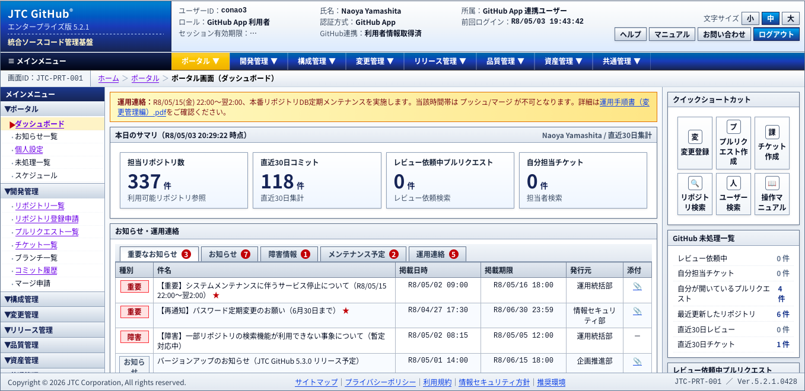
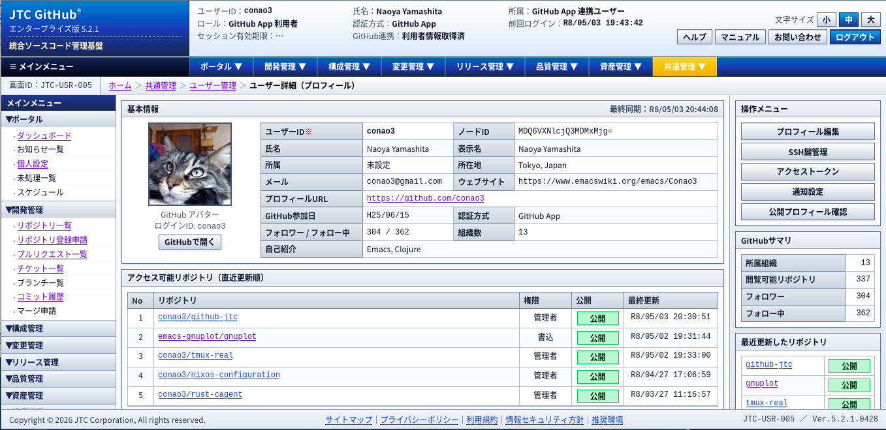
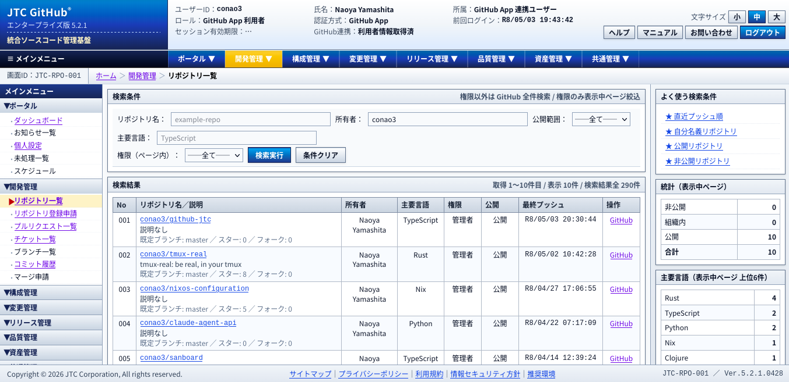
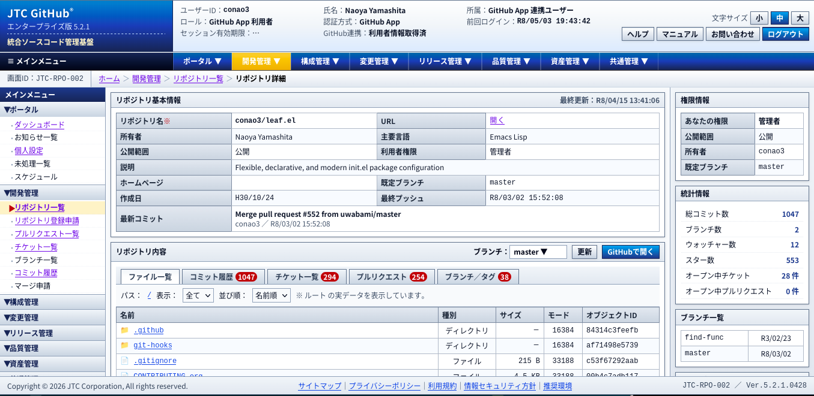

# github-jtc

A JTC-style GitHub frontend PoC.

## Screenshots

## Deploy

This repository assumes the following deployment split:

- GitHub Pages: frontend hosting
- Cloudflare Worker: GitHub App `code -> access token` exchange

### GitHub repository variables

- `APP_CLIENT_ID`
  GitHub App Client ID
- `APP_EXCHANGE_URL`
  Example:
  `https://github-jtc-auth-broker.<subdomain>.workers.dev/api/auth/github/exchange`
- `PAGES_BASE_PATH` optional
  Base path override when deploying somewhere other than a standard project site.
  If unset, it is derived from the repository name.
- `PAGES_BASE_URL` optional
  Full Pages URL used to derive the Worker's `ALLOWED_ORIGINS`.
- `WORKER_ALLOWED_ORIGINS` optional
  Comma-separated list of allowed origins for the Worker when you want to override
  auto-detection explicitly. Use origin values only, for example
  `https://conao3.github.io,http://localhost:5174`.
- `APP_REDIRECT_URI` optional
  Set this only if you want to hard-code the GitHub App callback URL.

### GitHub repository secrets

- `CLOUDFLARE_API_TOKEN`
  Used for Worker deployment
- `APP_CLIENT_SECRET`
  GitHub App Client Secret

### GitHub App settings

- Callback URL:
  `https://<owner>.github.io/<repo>/login/callback`
  For a user or organization site, use `https://<owner>.github.io/login/callback`.

### Workflows

- `.github/workflows/deploy-pages.yml`
  Pages build and deploy
- `.github/workflows/deploy-worker.yml`
  Cloudflare Worker deploy
